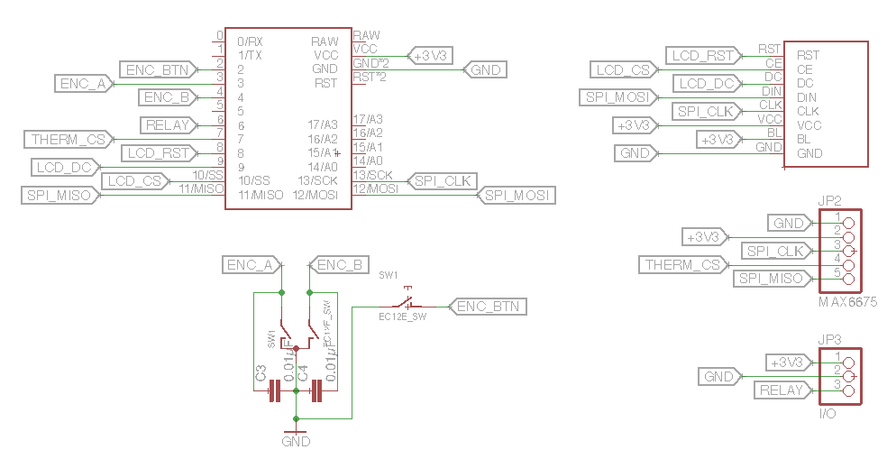

# Thermocouple PID Controller

A PID controller based on an Arduino using a MAX6675 Thermocouple module.

Current temperature and setpoint will be shown on the LCD display, along with current output state.

## Parts List

* Arduino Pro Mini 8MHz
* PCD8544 LCD Screen
* MAX6675 Thermocouple Module
* Rotary Encoder + debounce capacitors
* Relay to drive the output
